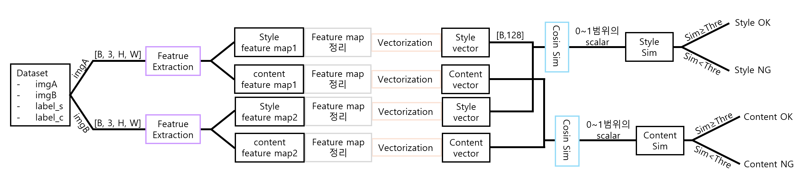
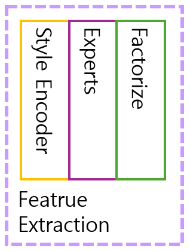
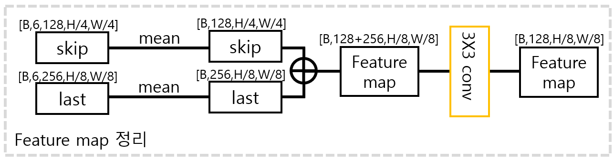
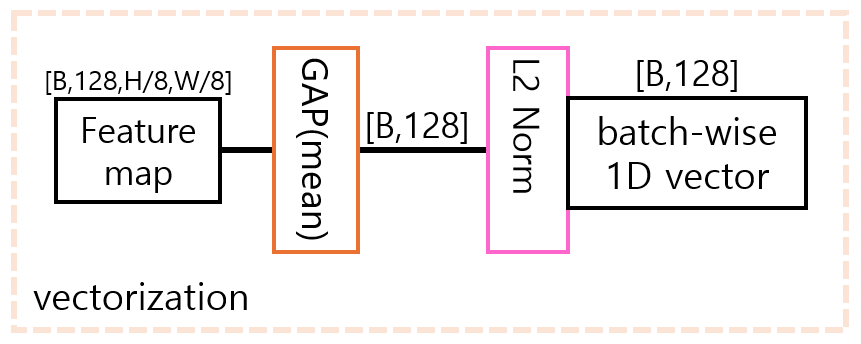

# base1
## new_api
- inference data와 train data 생성 코드
- train data
- generating_tar_img.py
    ```
    python new_api/generating_tar_img.py
    ```
## total_process
### 전체 flow
1. 사용자가 프롬프트 작성
2. 작성한 프롬프트 고도화 후 nanobanana pro api를 사용하여 이미지 생성 및 저장("output_images/프로젝트명" 에 저장)
3. 생성한 이미지의 글자 불량 여부 판단(OK/NG)
4. history에서 생성한 이미지들과 불량 여부 판단 기록 확인 가능

### mxfont_process
- MXDetector
- ref img와 비교하여 tar img에 글씨 오류가 있는지 탐지하는 모델
- 가져온 network
    - https://github.com/clovaai/mxfont.git
    - Encoder 부분
- model flow
    - 전체
    <br>
    - feature extraction 블록
    <br>
        - 자세한건 mxfont.git참고
    - feature_map 정리 블록
    <br>
    - vectorization 블록
    <br>

- train
    ```
    python train.py cfgs/train.yaml
    ```
    - 단일 gpu
        - train.yaml에서 use_ddp = False
    - 멀티 gpu
        - train.yaml에서 use_ddp = True
    - input
        - ref_path, tar_path, label_s, label_c
        - label
            - same=0
            - diff=1
    - setting
        - cfgs 아래 train.yaml파일 수정

- test
    ```
    python eval.py cfgs/eval.yaml --vis_n 100
    ```
    - option
        - vis_dir
            - 지정 시 유사도 히트맵 PNG 저장 디렉터리
        - vis_n
            - 저장할 샘플 개수
            - 기본값 0
            - 0이면 저장안함
        - 나머지는 cfgs 아래 eva.yaml에서 설정
    - 주의사항
        - 시작하기 전에 "com_map" 폴더 직접 만들고나서 시작

### seg_crop_process
- MXDetector로 들어가기전 segmentation하는 모델
- img_reconstruct.py
    ```
    python img_reconstruct.py
    ```
- input : data.csv(ref_path, tar_path) - pair data
- before start setting
    - terminal
        ```
        cd total_process
        mkdir checkpoints
        mkdir checkpoints/dinov2
        
        # linux
        wget -q -P ./checkpoints https://dl.fbaipublicfiles.com/segment_anything_2/072824/sam2_hiera_large.pt
        wget -q -P ./checkpoints/dinov2 https://dl.fbaipublicfiles.com/dinov2/dinov2_vitl14/dinov2_vitl14_pretrain.pth

        # window
        curl -L -o checkpoints/sam2_hiera_large.pt https://dl.fbaipublicfiles.com/segment_anything_2/072824/sam2_hiera_large.pt
        curl -L -o checkpoints/dinov2_vitl14_pretrain.pth https://dl.fbaipublicfiles.com/dinov2/dinov2_vitl14/dinov2_vitl14_pretrain.pth
        ```